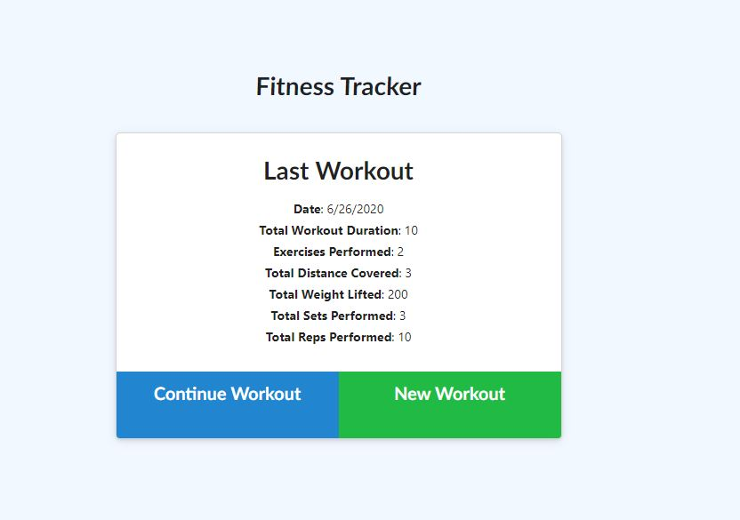
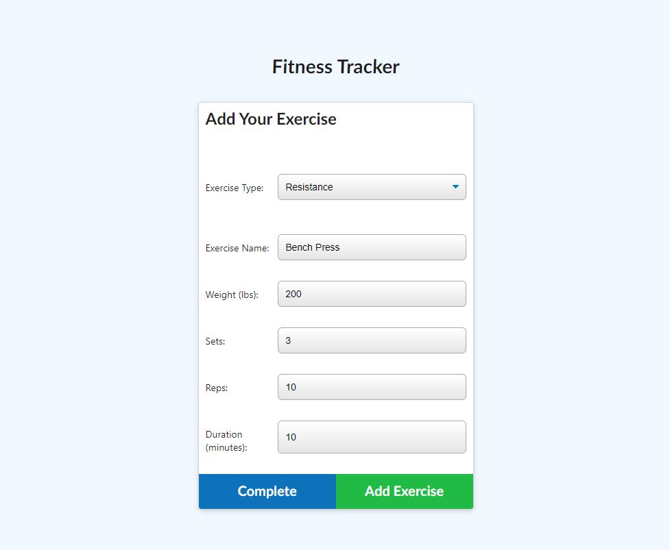
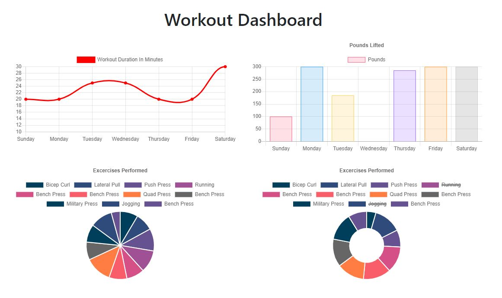

## Burger


## Description
Week 17 Homework - Fitness Tracker

## Motivation
This project will present users with a way to easily record and trck their fitness goals. It will allow for development of skills in MongoDB, Mongoose, and Express server functionality.

## Code Style
This project is written using JavaScript and uses the Mongoose Object Modeling package to communicate with the MongoDB server. Additionally, Node.js is utilized to handle asynchronous calls to the server.

The workout object modeled in Mongoose is simple and constantly builds an array of exercises as the user adds to them.

```javascript
const workoutSchema = new Schema({
  day: {
    type: Date,
    required: "Enter a date for this workout",
    default: Date.now,
  },
  exercises: Array,
  totalDuration: {
    type: Number,
    default: 0,
  },
});
  ```

As exercises are added, they are pushed to the existing array and the total duration for all exercises is calculated and updated.

  ```javascript
router.put("/api/workouts/:id", async (req, res) => {
  const workout = await Workout.findOne({ _id: req.params.id });
  workout.totalDuration += req.body.duration;
  Workout.updateOne(
    { _id: req.params.id },
    {
      $push: { exercises: req.body },
      $set: { totalDuration: workout.totalDuration },
    }
  )
    .then((result) => {
      res.json(result);
    })
    .catch((err) => {
      res.status(400).json(err);
    });
});
  ```

Additionally, HTML routes are handled by sending files directly to the front end on request.

  ```javascript
router.get("/exercise", (req, res) => {
  res.sendFile(path.join(__dirname, "../public/exercise.html"));
});
  ```

The most recently created workout is automatically detected with an option to continue it or start a new one.




Required stats for a given exercise are presented to the user based on the type of exercise selected.




Stats are pulled from the most revent week of data available and presented in a way that is easy to read and understand.




## Features
Data is stored securely to allow for future development and presentation.

Date validation ensures a uniform and consistent record regardless of input.

# How to Use
Dependencies must be installed individually or via package.json file
* Express
* Mongoose
* Morgan

From the landing page, choose to either continue the last started workout or start a new workout.

On the exercise page, choose either cardio or resistance and then fill in the relevant data. To record it and add another exercise, choose "Add Exercise" or to record it and complete the workout choose "Complete".

Visit the Fitness Tracker dashboard for detailed information regarding revent workout data recorded.

